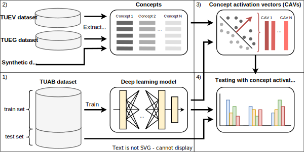

# TCAV In Biosignals
##

## Data
All datasets used in this work were downloaded from the [Temple University Hosptital
(TUH) EEG Corpus](https://isip.piconepress.com/projects/tuh_eeg/html/downloads.shtml). 
Please cite the original authors when working with the data. We used the following 
data sources (version):
* TUAB (v3.0.0)
* TUEG (v2.0.0) - up to subfoler 006/
* TUEV (v2.0.0)

## Data Preparation
The scripts located under *project/src/dataset/scripts* are used to pre-process and 
load the data from the original source.

## Deep Learning Model
We use the XceptionTime architecture originally presented by 
[Rahimian et al.](https://arxiv.org/abs/1911.03803v1) and based on the implementation
from [*tsai*](https://timeseriesai.github.io/tsai/).

The trained model checkpoint is located under 
[*data/checkpoints/cp_xceptiontime_v5*](data/checkpoints/cp_xceptiontime_v5/params.pt).

Performance on the dedicated TUAB test set:
| Accuracy | Balanced Accuracy | F1     | Precision | Recall |
| :------: | :---------------: | :----: | :-------: | :----: |
| 0.8514   | 0.8519            | 0.8405 | 0.8244    | 0.8571 |

To re-create our classification results, run the scripts located under 
*project/src/ml/scripts*.

## TCAV Experiments
The CAVs for all experiments were computed from the last four layers of the trained 
neural network. We refer to them as the network head according to the notation from
[*tsai*](https://timeseriesai.github.io/tsai/).

Sizes of the latent space representations of the final network layers from the used XceptionTime model:
| Network layer | head.0    | head.1    | head.2   | head.3  |
| ------------- | :-------: | :-------: | :------: | :-----: |
| Output shape  | [384, 50] | [192, 50] | [96, 50] | [32, 2] |

After preparing the data following the previously described steps, we got the following
data sources that were taken for the generation of representative concept samples. 
While the number of available samples may differ between concept groups, random 
sub-sampling of 75 samples was used in each TCAV run.

| Data source | Concept class | Number of samples |
| ----------- | :-----------: | :---------------: |
| TUEV        | SPSW          | 80                |
| TUEV        | GPED          | 505               |
| TUEV        | PLED          | 718               |
| TUEV        | EYEM          | 269               |
| TUEV        | ARTF          | 357               |
| TUEV        | BCKG          | 664               |
| TUEG        | Random        | 184               |
| TUEG        | Male          | 100               |
| TUEG        | Female        | 100               |
| TUEG        | Elderly       | 100               |
| TUEG        | Young         | 79                |

To re-create our TCAV results, run the scripts located under *project/src/tcav/scripts*.

## Citation
Please use the following citation:

## License
[MIT License](LICENSE)